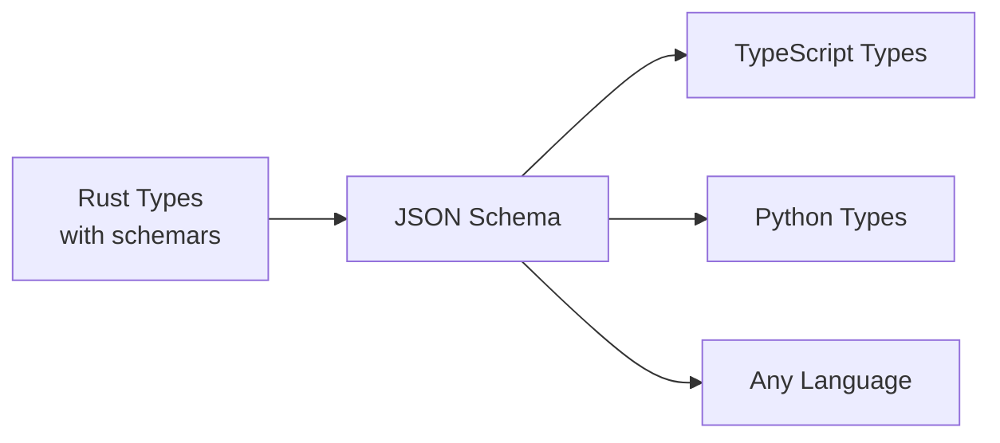

# TypeScript Constraint Generator Example

This example demonstrates the **Rust → JSON Schema → TypeScript** workflow for type-safe constraint generation across languages.

## The Type Generation Pipeline



## 1. Rust Types (Source of Truth)

In `crates/core/src/ir.rs`, we define our types with `schemars`:

```rust
use schemars::JsonSchema;
use serde::{Deserialize, Serialize};

#[derive(Debug, Clone, Serialize, Deserialize, JsonSchema)]
pub struct InputDocument {
    #[schemars(regex(pattern = r"^slvs-json/1$"))]
    pub schema: String,
    pub units: String,
    pub parameters: HashMap<String, f64>,
    pub entities: Vec<Entity>,
    pub constraints: Vec<Constraint>,
}

#[derive(Debug, Clone, Serialize, Deserialize, JsonSchema)]
#[serde(tag = "type", rename_all = "snake_case")]
pub enum Entity {
    Point { id: String, at: Vec<ExprOrNumber> },
    Line { id: String, p1: String, p2: String },
    Circle { id: String, center: Vec<ExprOrNumber>, diameter: ExprOrNumber },
    // ... more variants
}
```

## 2. Generate JSON Schema from Rust

```bash
# This binary uses schemars to generate JSON Schema
cargo run --bin generate-schema --features mock-solver > schema.json
```

This produces a complete JSON Schema that perfectly matches our Rust types.

## 3. Generate TypeScript Types from JSON Schema

Using `json-schema-to-typescript` or manually:

```bash
npm install -g json-schema-to-typescript
json2ts schema.json > types.ts
```

This gives us TypeScript types that are **guaranteed** to match the Rust types:

```typescript
export interface InputDocument {
  schema: "slvs-json/1";
  units?: string;
  parameters?: { [key: string]: number };
  entities: Entity[];
  constraints: Constraint[];
}

export type Entity = PointEntity | LineEntity | CircleEntity | ...;
```

## 4. Use TypeScript to Generate Complex Constraints

Now we can write TypeScript that generates valid constraint documents:

```typescript
import { InputDocument, PointEntity, LineEntity } from './types';

function generateTruss(panels: number): InputDocument {
  const doc: InputDocument = {
    schema: "slvs-json/1",
    units: "mm",
    parameters: {},
    entities: [],
    constraints: []
  };
  
  // Generate complex constraint system...
  // TypeScript compiler ensures everything matches the schema!
  
  return doc;
}
```

## 5. Benefits of This Approach

✅ **Single Source of Truth**: Rust types define everything  
✅ **Type Safety Everywhere**: TypeScript/Python/etc all get compile-time checking  
✅ **Automatic Compatibility**: Changes in Rust automatically propagate  
✅ **No Manual Sync**: No need to manually keep types in sync  
✅ **IDE Support**: Full autocomplete and type checking in all languages  

## Example: Parametric Bridge Truss Generator

The included `generator.ts` demonstrates generating a complex Warren Truss bridge:

```bash
# Run the generator
node generator.js

# This creates: generated_parametric_truss.json
# With 35 entities and 27 constraints!

# Solve with SLVSX
slvsx solve generated_parametric_truss.json

# Visualize
slvsx export generated_parametric_truss.json --format svg --output truss.svg
```

## Workflow for Other Languages

### Python
```bash
# Generate Python types from JSON Schema
datamodel-codegen --input schema.json --output types.py
```

### Java
```bash
# Use jsonschema2pojo
jsonschema2pojo --source schema.json --target java-types/
```

### Go
```bash
# Use go-jsonschema
go-jsonschema -p types schema.json > types.go
```

## Key Insight

By using Rust with `schemars` as the source of truth, we get:

1. **Rust** → Defines the canonical types with validation rules
2. **JSON Schema** → Language-agnostic contract 
3. **Any Language** → Generated types that perfectly match

This means an AI agent written in Python, a web UI in TypeScript, and a CLI in Rust can all share the exact same constraint format with compile-time guarantees!

## Complete Example Files

- `schema.json` - Generated JSON Schema from Rust types
- `types.ts` - TypeScript types from JSON Schema  
- `generator.ts` - Complex constraint generator using the types
- `generated_parametric_truss.json` - Output ready for SLVSX

This is the power of the Rust → JSON Schema → X workflow!